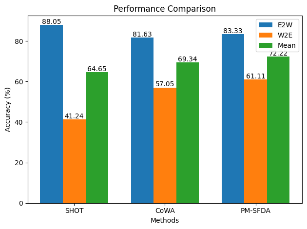

## PM-SFDA 
This repository contains the implementation of "Prototype-Guided Memory for Source-Free Remote Sensing Scene Classification" paper.

In this work, we introduce a novel approach for source-free domain adaptation, termed __Prototype-Guided Memory for Source-Free Remote Sensing Scene Classification (PM-SFDA)__. This framework adapts a pre-trained source model to an unlabeled target domain without requiring access to source data, thereby addressing the challenges of domain shift in remote sensing scene classification.

## Results
The bar chart presents the classification accuracy (%) on cross-sensor remote sensing (RS) image scene datasets for two source–target pairs. Each group of bars represents a specific method, while each bar within the group indicates the classification accuracy achieved on a given source–target transfer task (E2W, W2E, and Mean). Overall, the proposed method achieves a mean accuracy of 72.22%, outperforming state-of-the-art approaches by 2.88%.



## Datasets
Our paper assesses performance on  transfer tasks utilizing the cross-sensor dataset.
* WHU-RS19 (W) -> EuroSAT (E) => W2E
* EuroSAT (E) -> WHU-RS19 (W) => E2W
  
#### Shared classes
The tables below summarize the shared classes among all considered datasets and their corresponding label assignments.
<table width="100%">
<tr>
<td valign="top" width="33%">

<b>WHU-RS19 and EuroSAT</b>
<table>
<tr><th>Shared</th><th>WHU-RS19</th><th>EuroSAT</th></tr>
<tr><td>Farmland</td><td>Farmland</td><td>AnnualCrop</td></tr>
<tr><td>Forest</td><td>Forest</td><td>Forest</td></tr>
<tr><td>Industry</td><td>Industrial</td><td>Industrial</td></tr>
<tr><td>Meadow</td><td>Meadow</td><td>Pasture</td></tr>
<tr><td>Residential</td><td>Residential</td><td>Residential</td></tr>
<tr><td>River</td><td>River</td><td>River</td></tr>
</table>
</td>
</tr>
</table>
## Usage

* Clone the Repository:

```ruby
  git clone https://github.com/ManelKhazriKhlifi/PM-SFDA.git
```
## Citation

If you use any part of this work please cite using the following Bibtex format:
```
@Article {khelifi2026PM-SFDA,
AUTHOR = {Manel Khazri Khelifi and Adel Ammar and Wadii Boulila and Imed Riadh Farah},
TITLE = {CAB-SFDA: Prototype-Guided Memory for Source-Free Remote Sensing Scene Classification},
JOURNAL = {},
VOLUME = {},
YEAR = {2026},
NUMBER = {},
ARTICLE-NUMBER = {},
URL = {},
ISSN = {},
DOI = {}
}
```
